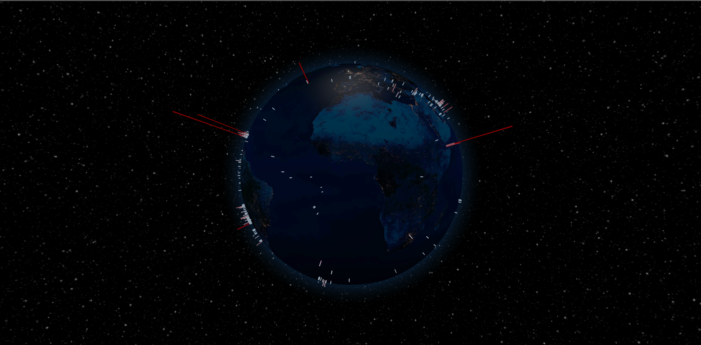
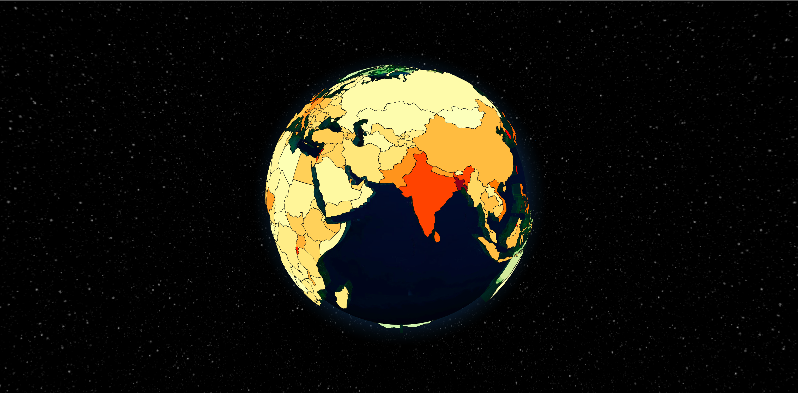

# 3D visualization in React
Showing geo data on a 3D globe is really fulfilling so I tried out this awesome library called [react-globe.gl](https://github.com/vasturiano/react-globe.gl).

I have two globes in this react app. One showing recent earthquakes and the other one showing the population density of the countries of the world. The first one was straight-forward to implement but the second one was a bit tricky. I had to use an external API to write 'area' data to the geojson file and then use that file to render the globe using d3 to get the corresponding colors.

## Recent Earthquakes
Recent earthquakes happening around the world.
 

  

 

## Population Density
Population density of the countries of the world, though the data is not very recent.
 

  

 

## How to run the app
- Clone the repo
- Run `npm install` or `yarn install` to install the dependencies
- Run `npm start` or `yarn start` to start the app
- Open [http://localhost:3000](http://localhost:3000) to view it in the browser.

## Writing Area To the GeoJSON File
I had to write the area data to the geojson file using an external API to get things working. So I just put the folder there. You don't have to worry about that. You can take a look at it if you want to.

## References
- [react-globe.gl](https://github.com/vasturiano/react-globe.gl)